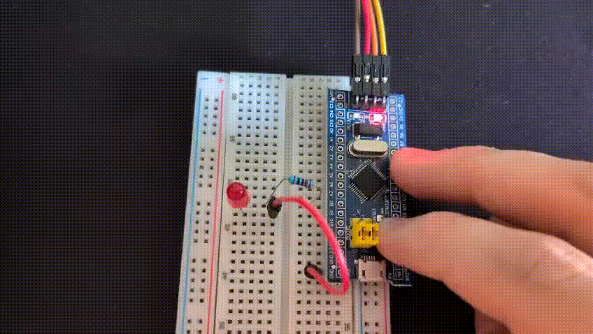

# tinyRTOS

A minimal preemptive RTOS for ARM Cortex-M, built from scratch to understand schedulers, context switching, TCBs, and interrupts at the register and stack level. A learning project — not a FreeRTOS replacement.

Runs on real hardware: STM32F103C8T6 (Blue Pill), Cortex-M3, bare metal — no HAL, own linker script and startup, hand-written context switch in ARMv7-M assembly, SysTick driving the tick, PendSV doing the switch.

More details on my website: <a href="https://andrearossetti.me/projects/tinyRTOS" target="_blank">andrearossetti.me</a>

## Layout

```
linux/    reference implementation on Linux — ucontext context switching,
          SIGALRM/setitimer tick. The scheduler was developed and debugged
          here first, with nothing but plain gdb.
stm32/    the real thing — bare-metal Cortex-M3. Preemptive, PendSV context
          switch in assembly, SysTick 1 ms tick.
```

The split exists because the interesting parts of an RTOS — the scheduler, run queue, blocking primitives, the tick — are independent of *how* the context switch is implemented. The scheduler logic was built and verified on Linux, then ported to hardware by replacing only the context-switch and tick mechanisms. `swapcontext` became hand-written register save/restore; `SIGALRM` became SysTick.

## What's implemented

- Preemptive round-robin scheduler with a 1 ms SysTick tick (stm32) / 10 ms SIGALRM tick (linux)
- TCBs with per-task stacks, `READY`/`BLOCKED` states, and tick-based wakeup
- `task_delay(ticks)` blocking primitive
- Context switch in PendSV: hardware stacks half the registers, the handler saves/restores r4–r11 and swaps PSP
- Manual first-task launch (fake exception frame built by `task_stack_init`)
- Idle task to keep the run queue non-empty

Not implemented (deliberately): synchronization primitives, priorities, dynamic task creation, stack overflow detection.

## Build and run

**stm32** (needs `arm-none-eabi-gcc` and `stlink`; ST-Link V2 wired via SWD):

```
cd stm32
make
make flash
```

The onboard LED blinks at 1 Hz; an LED on PB0 (through a resistor to GND) blinks at 5 Hz. Two tasks, visibly independent.

**linux:**

```
cd linux
make
make run
```

Two tasks print at different rates, paced by wall-clock time. Ctrl-C to stop.

## Demo



Two LEDs, two tasks, one scheduler: the onboard LED (PC13) toggles every 500 ms, an external LED (PB0) every 100 ms — independent rhythms under preemptive round-robin, with an idle task absorbing the gaps.

